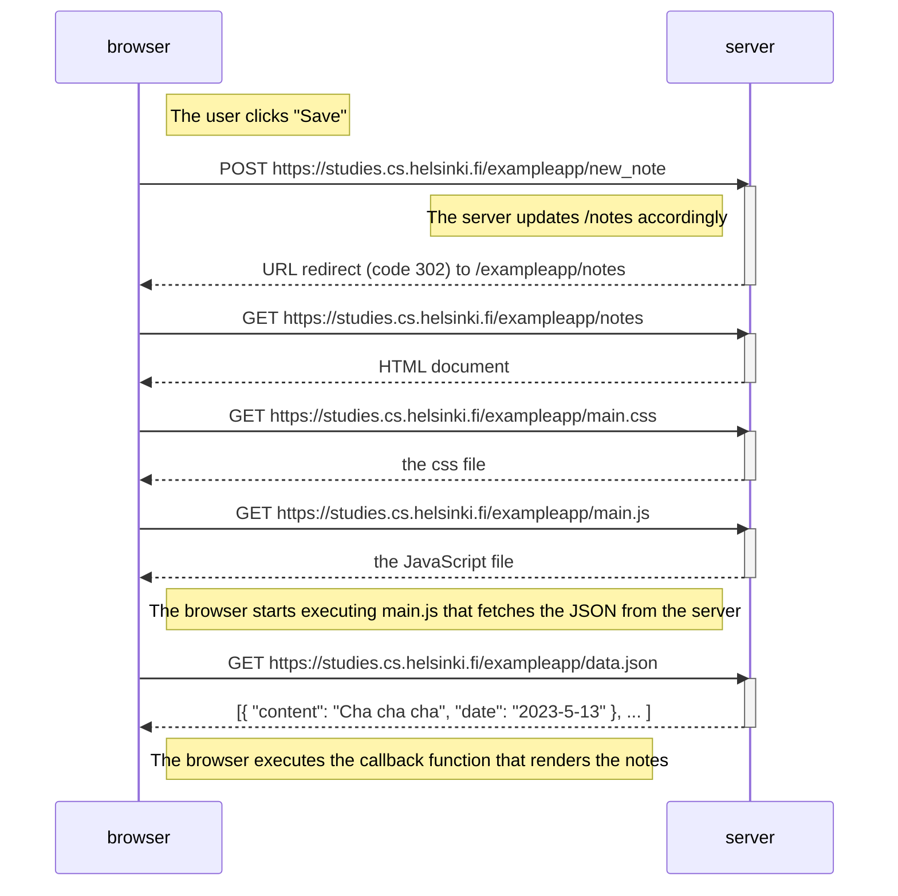

```mermaid
    sequenceDiagram
        participant browser
        participant server

        Note right of browser: The user clicks "Save" 
        browser->>server: POST https://studies.cs.helsinki.fi/exampleapp/new_note
        activate server
        Note left of server: The server updates /notes accordingly
        server-->>browser: URL redirect (code 302) to /exampleapp/notes
        deactivate server

        browser->>server: GET https://studies.cs.helsinki.fi/exampleapp/notes
        activate server
        server-->>browser: HTML document
        deactivate server

        browser->>server: GET https://studies.cs.helsinki.fi/exampleapp/main.css
        activate server
        server-->>browser: the css file
        deactivate server

        browser->>server: GET https://studies.cs.helsinki.fi/exampleapp/main.js
        activate server
        server-->>browser: the JavaScript file
        deactivate server

        Note right of browser: The browser starts executing main.js that fetches the JSON from the server

        browser->>server: GET https://studies.cs.helsinki.fi/exampleapp/data.json
        activate server
        server-->>browser: [{ "content": "Cha cha cha", "date": "2023-5-13" }, ... ]
        deactivate server

        Note right of browser: The browser executes the callback function that renders the notes
```