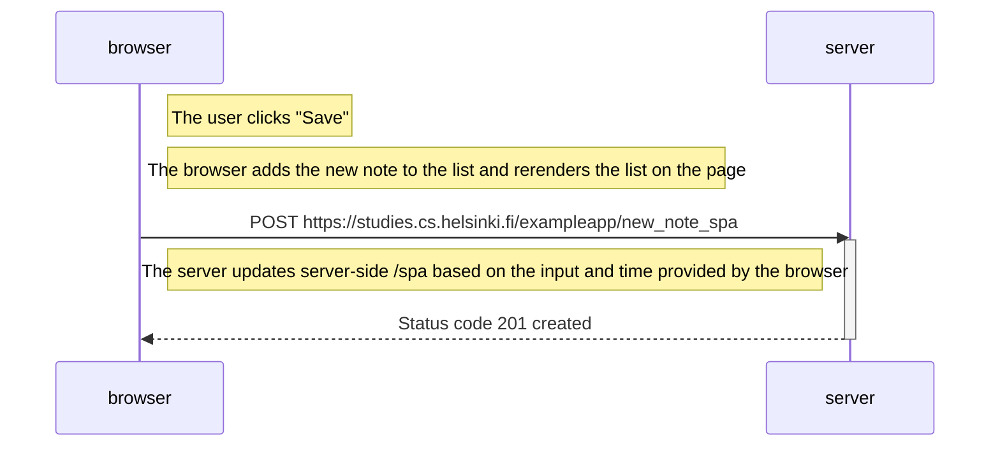

```mermaid
    sequenceDiagram
        participant browser
        participant server

        Note right of browser: The user clicks "Save" 
        Note right of browser: The browser adds the new note to the list and rerenders the list on the page
        browser->>server: POST https://studies.cs.helsinki.fi/exampleapp/new_note_spa
        activate server
        Note left of server: The server updates server-side /spa based on the input and time provided by the browser
        server-->>browser: Status code 201 created
        deactivate server
```